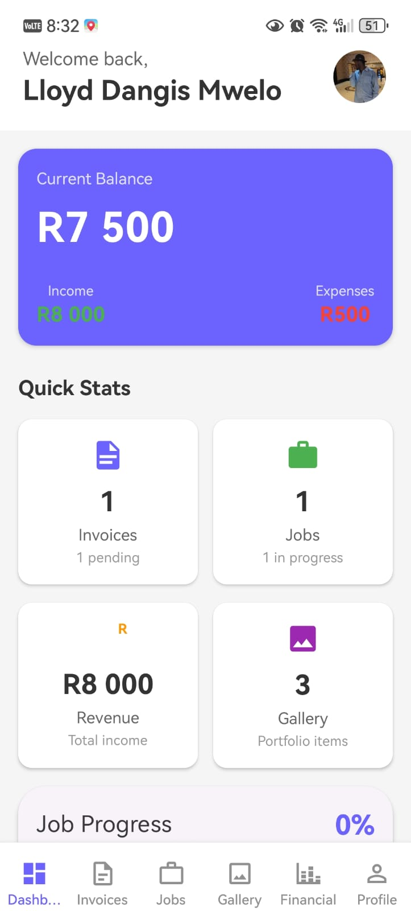
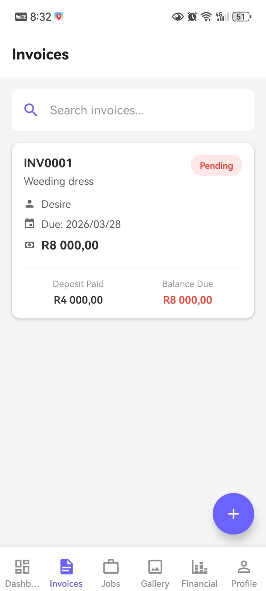
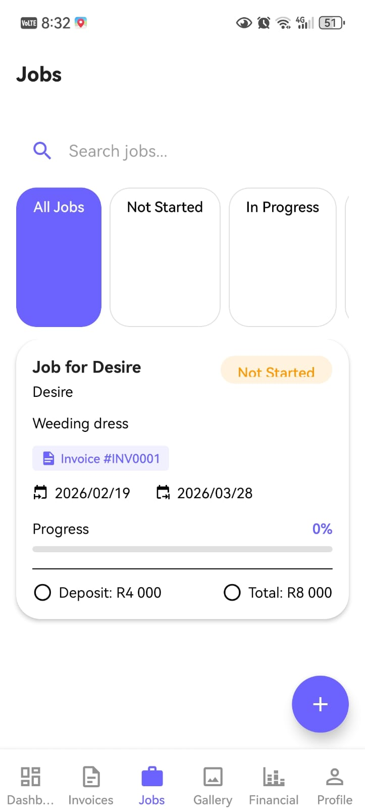
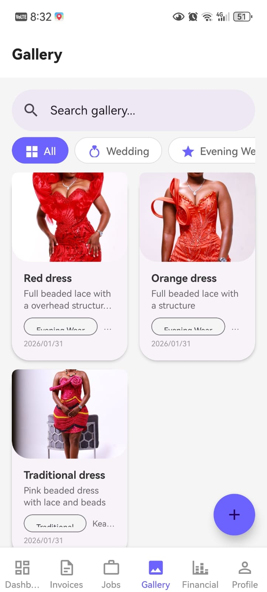
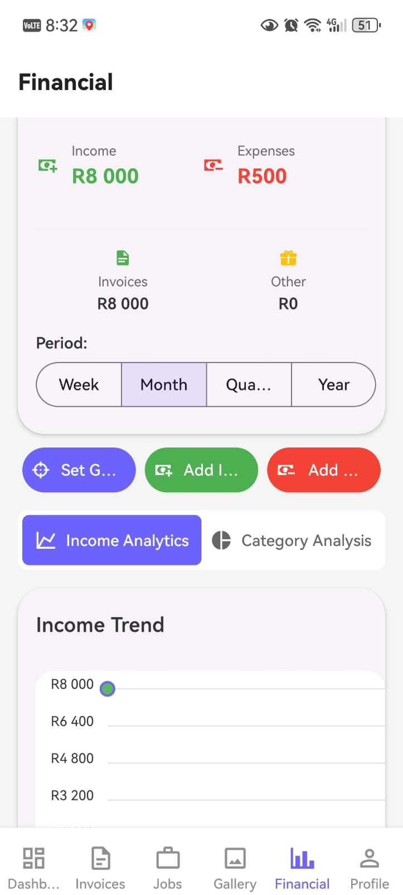

## Who is this app for?

This app is perfect for:
- **Fashion Designers** - Manage your custom clothing business
- **Tailors & Seamstresses** - Keep track of alteration jobs and customers
- **Fashion Studio Owners** - Run your entire studio operations
- **Boutique Owners** - Manage made-to-order pieces
- **Wedding Dress Designers** - Handle complex bridal orders with deposits and payments

Basically, if you create, alter, or design clothes for clients, this app is for you!

---

## 📷 Screenshots

*Dashboard - Your business at a glance*

*Invoices - Track payments and deposits*

*Jobs - Monitor every project*

*Gallery - Showcase your work*

*Financial - Know your numbers*

---

## What can the app do?

### 📊 **Dashboard - Your Business at a Glance**
When you open the app, you'll see:
- Your current business balance
- How many jobs are in progress
- Recent invoices and payments
- Monthly income and expenses
- Business growth statistics

### 📝 **Invoices - Get Paid Professionally**
- Create beautiful, professional invoices for your clients
- Automatically calculate totals, tax, and deposits
- Track who has paid and who still owes money
- Set up deposits (like 50% upfront) and final payments
- View all your invoices in one list
- See payment status at a glance (paid, pending, overdue)

### 👔 **Jobs - Track Every Project**
- Keep track of every piece you're working on
- Record customer details and measurements
- Set due dates so you never miss a deadline
- Track progress from "just started" to "completed"
- Link jobs directly to invoices
- Add notes about special requests or fabric details

### 🖼️ **Gallery - Showcase Your Work**
- Build a beautiful portfolio of your best pieces
- Upload multiple photos of each design
- Organize by category (wedding, evening wear, alterations)
- Add tags like "#weddingdress" or "#suit" to organize
- Track how many views and likes each piece gets
- Show potential clients your best work

### 💰 **Financial - Know Your Money**
- **Track Expenses** - Record every purchase (fabric, thread, buttons, equipment)
- **Add Income** - Log payments from all sources
- **Set Financial Goals** - Example: "Save R5000 by December"
- **See Monthly Trends** - Know when your business is busiest
- **View All Transactions** - Complete history of every payment
- **Profit Analysis** - See exactly how much you're making

### 👤 **Profile - Your Business Identity**
- Store your business name and contact details
- Add a professional profile picture
- Track your starting capital vs current balance
- See your business growth percentage
- Customize app appearance (light/dark mode)

---

## Why is this app perfect for your brother?

### ✅ **No Complicated Setup**
The app starts immediately - no login, no passwords to remember, no email verification. Just open and use!

### ✅ **Everything in One Place**
No more sticky notes, scattered notebooks, or trying to remember who paid what. All your business info is organized digitally.

### ✅ **Track Deposits Properly**
Fashion designers often take deposits. This app tracks:
- How much deposit was paid
- Whether it's received
- How much is still owed
- When final payment is due

### ✅ **Never Miss a Deadline**
With due dates on jobs, you'll always know which orders need to be finished and when.

### ✅ **Professional Image**
Send clients professional-looking invoices instead of handwritten receipts. It makes your business look more established.

### ✅ **Know Your Numbers**
At the end of the month, you'll know exactly:
- How much you spent on fabric
- How much you earned from each job
- Whether your business is growing
- Which months are your busiest

---

## The Technology Behind It

- **Built For:** iOS and Android (cross-platform)
- **Works Offline:** All data stays on your device
- **Privacy First:** Your business information never leaves your phone

---

## Getting Started

Once installed, just open the app and start adding your first job or invoice. The app comes with a default profile you can customize with your own business name and details.

No tutorials needed - just tap the + buttons and start typing!

---

## Made for Real Designers

This app was created because running a fashion business means juggling so many things at once:
- Talking to clients
- Taking measurements
- Sourcing fabrics
- Managing payments
- Meeting deadlines
- Building a portfolio
- Tracking business finances

Fallo Tailor handles the business side so you can focus on what you do best - creating amazing designs!

---

*"Because your talent deserves a business that runs as smoothly as your sewing machine."*